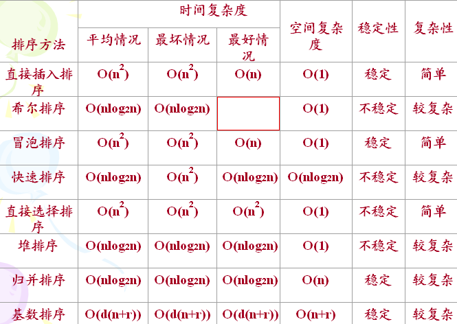

# sort-array
排序数组  
  

##项目计划使用多种排序方法对数组排序：
    1.冒泡排序<a name="1" />  
    2.直接选择排序<a name="1" />  
    3.直接插入排序<a name="1" />  
    4.快速排序<a name="1" />  
    5.希尔排序<a name="1" />  
    6.归并排序<a name="1" />  
    7.堆排序<a name="1" />  
    8.基数排序<a name="1" />  
    9.基数排序<a name="1" />  
    10.桶排序<a name="1" />  
