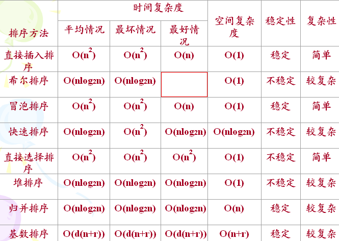

# sort-array
排序数组  
  

#项目计划使用多种排序方法对数组排序:  
  <a href="#1">1.冒泡排序</a>  
  <a href="#2">2.直接选择排序</a>  
  <a href="#3">3.直接插入排序</a>  
  <a href="#4">4.快速排序</a>  
  <a href="#5">5.希尔排序</a>  
  <a href="#6">6.归并排序</a>  
  <a href="#7">7.堆排序</a>  
  <a href="#8">8.基数排序</a>  
  <a href="#9">9.计数排序</a>  
  <a href="#10">10.桶排序</a>  
    
## 比较排序  
### 冒泡排序<a name="1" />：  
  1.比较相邻的元素：如果第一个比第二个大，就交换他们两个  
  2.对每一对相邻元素作同样的工作，从开始第一对到结尾的最后一对  
  3.针对所有的元素重复以上的步骤，除了最后一个  
  4.持续每次对越来越少的元素重复上面的步骤，直到没有任何一对数字需要比较  
  
    
### 直接选择排序<a name="2" />:  
  1.第一次从R[0]~R[n-1]中选取最小值，与R[0]交换  
  2.第二次从R{1}~R[n-1]中选取最小值，与R[1]交换  
  3.第i次从R[i-1]~R[n-1]中选取最小值，与R[i-1]交换  
  4.第n-1次从R[n-2]~R[n-1]中选取最小值，与R[n-2]交换,总共通过n-1次  
  
    
### 直接插入排序<a name="3" />:  
  1.每次从无序表中取出第一个元素，把它插入到有序表的合适位置，使有序表仍然有序  
  2.第一趟比较前两个数，然后把第二个数按大小插入到有序表中  
  3.第二趟把第三个数据与前两个数从后向前扫描，把第三个数按大小插入到有序表中  
  4.依次进行下去，进行(n-1)趟扫描以后就完成了整个排序过程  
  
    
### 快速排序<a name="4" />:  
  1.首先任意选取一个数据（通常选用数组的第一个数）作为关键数据  
  2.将所有比它小的数都放到它前面，所有比它大的数都放到它后面，这个过程称为一趟快速排序  
  3.再按此方法对这两部分数据分别进行快速排序，整个排序过程可以递归进行  
  
    
### 希尔排序<a name="5" />:  
  1.先取一个小于n的整数d1作为第一个增量，把文件的全部记录分组，所有距离为d1的倍数的记录放在同一个组中  
  2.在各组内进行直接插入排序  
  3.取第二个增量d2\<d1重复上述的分组和排序  
  4.直至所取的增量dt=1(dt<···\<d2\<d1)，即所有记录放在同一组中进行直接插入排序为止  
  
    
### 归并排序<a name="6" />:  
  1.申请空间，使其大小为两个已经排序序列之和，该空间用来存放合并后的序列  
  2.设定两个指针，最初位置分别为两个已经排序序列的起始位置  
  3.比较两个指针所指向的元素，选择相对小的元素放入到合并空间，并移动指针到下一位置  
  4.重复步骤3直到某一指针超出序列尾将另一序列剩下的所有元素直接复制到合并序列尾  
  
    
### 堆排序<a name="7" />:  
  1.将初始文件R[1..n]建成一个大根堆，此堆为初始的无序区  
  2.再将关键字最大的记录R[1]（即堆顶）和无序区的最后一个记录R[n]交换  
  3.由此得到新的无序区R[1..n-1]和有序区R[n]，且满足R[1..n-1].keys≤R[n].key  
  4.由于交换后新的根R[1]可能违反堆性质，故应将当前无序区R[1..n-1]调整为堆  
  5.再次将R[1..n-1]中关键字最大的记录R[1]和该区间的最后一个记录R[n-1]交换  
  6.由此得到新的无序区R[1..n-2]和有序区R[n-1..n]，且仍满足关系R[1..n-2].keys≤R[n-1..n].keys  
  7.同样要将R[1..n-2]调整为堆，直到无序区只有一个元素为止  
  
    
## 非比较排序  
### 基数排序<a name="8" />:  
  LSD  
  1.首先根据个位数的数值，在走访数值时将它们分配至编号0到9的桶子中  
  2.将这些桶子中的数值重新串接起来,再进行一次分配，这次是根据十位数来分配(无数字时补0)  
  3.接下来将这些桶子中的数值重新串接起来，再按百位分配，持续进行以上的动作直至最高位数为止  
  
  MSD  
  1.方式与LSD相反，是由高位数为基底开始进行分配  
  2.但在分配之后并不马上合并回一个数组中，而是在每个“桶子”中建立“子桶”  
  3.将每个桶子中的数值按照下一数位的值分配到“子桶”中，在进行完最低位数的分配后再合并回单一的数组中  
  
### 计数排序<a name="9" />:  
  使用一个额外的数组C，其中第i个元素是待排序数组A中值等于i的元素的个数  
  根据数组C来将A中的元素排到正确的位置  
  1.找出待排序的数组中最大和最小的元素  
  2.统计数组中每个值为i的元素出现的次数，存入数组C的第i项  
  3.对所有的计数累加（从C中的位置为1的元素开始，每一项和前一项相加）  
  4.反向填充目标数组：将每个元素i放在新数组的第C(i)项，每放一个元素就将C(i)减去1
  
### 桶排序<a name="10" />:
  将数组分到有限数量的桶子里，再单独对每个箱子排序（可使用其他算法）  
  1.设置一个定量的数组当作空桶子  
  2.寻访串行，并且把项目一个一个放到对应的桶子去（hash）  
  3.对每个不是空的桶子进行排序  
  4.从不是空的桶子里把项目再放回原来的串行中  
  
